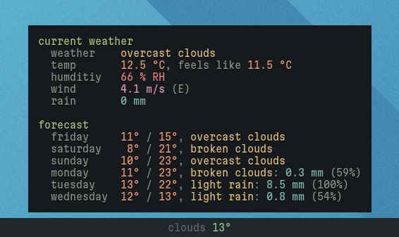

# waybar-weather

A simple weather module for Waybar based on data from OpenWeatherMap that also
comes with a handy CLI.

## Preview



## Usage

### Initial Steps

1. Obtain a valid API key from OpenWeatherMap (the free tier is enough)
2. Change the `API_KEY` variable in the script to your API key
3. Get the coordinates of the place you want to receive the data for by running
   `./weather.py geocoding <city[,state][,country]>` with an appropriate search
   term, e.g. `./weather.py geocoding London,CA` for London, Canada.
4. Change the `LATITUDE` and `LONGITUDE` variables in the script to the values
   received in the previous step

### CLI

The available subcommands for CLI usage, besides the already discussed
`geocoding` are:

- `current`: information about current weather conditions
- `forecast[-daily]`: forecast data for the next ~5 days, daily
- `forecast-detail`: forecast data for the next ~5 days in 3h intervals

Sample usage: `./weather.py current`

### Waybar Integration

To integrate the weather widget with Waybar, create a custom module:

```json
"custom/weather": {
  "exec": "~/.config/waybar/weather.py waybar",
  "restart-interval": 900,
  "return-type": "json",
},
```

Remember to change the path to the `weather.py` script specified within the
`exec` field.

Then, include the `custom/weather` module in your desired module list.

By default, the module will display the current weather category and
temperature in the bar. When hovering the mouse over the widget, a tooltip will
pop up with detailed information about the current weather and a forecast for
the next ~5 days.

The colors used within the widget and tooltip may be changed in the
`weather.py` script in order to match your colorscheme.
